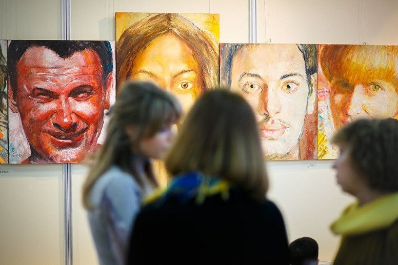

# Project_33
#### Video Demo:  https://www.youtube.com/watch?v=dokJ4RaY_j4
#### Description:
The site is about Russian modern artist's project.

I've integrated some features from **Bootstrap** into the site.

On this site you can learn about the project itself, its artist and get a first impression of the paintings.

**V-YA**:+1:

--
## About Project_33:

> Victor Yaichnikov's new project is called "33". They are really thirty three human faces united by terrestrial lifetime and an image of Christ. The allusion is obvious: an epistyle of templon, an iconostasis, a medieval polyptich.

> And almost at once, by contrast, there is a doubt: whether similar unambiguity of interpretation is lawful? The infinite variety of images of human cosmos overturns any even most settled and time-honoured scheme.

> Here they are beside: the native, the hardly familiar and casually seen friends , the bible characters and our contemporaries, children, old men, the baby at mother’s breast, the enamored and simply kissing…

> A picturesque technique (acryle, oil) aggravates feelings of the borderline intonations in its genre sense: not a portfolio, but also not the cabinet grotesque.

> Searching of uniform hierarchy of values in this case is hardly probable pertinent.

> However, here that the artist speaks: "It would be better to break off a distance between people. In fact we do not look at each other in the eyes!" The matter is not only in an author's reflection. The faces, as well as destinies are connected unpredictably,
linked with each other. Whether this certificate of embodiment of the divine plan in any Brown movement, especially, in the elementary sequence of objects. The communication of the plan and the stunning result shown to us is not argued (conclusive).



```
Творческая биография Виктора Яичникова небогата внешними событиями: родился 30 декабря 1962 года, в 1980–1985 гг. учился на художественно-графическом факультете ЛГПИ, член Союза художников РФ с 2002 года. На его счету – участие более чем в двух десятках выставок в России и за рубежом, среди которых – две персональные (1999 и 2002, обе – галерея «Соло», Липецк). Полотна художника находятся в частных собраниях стран Европы, Азии и Америки (Швеция, Италия, Великобритания, ФРГ, Норвегия, Португалия, Китай, США и другие).
С начала творческой деятельности Яичникову остаются присущи высокая требовательность к живописной технике, постоянное стремление к совершенствованию ее приемов. Формальная изысканность живописной поверхности в его работах строится на сочетании широкой, свободной манеры письма с гладкой, полированной фактурой и точной разработкой тонального решения в подмалевке. Особое внимание к лессировкам цветными лаками усиливает эффект вибрации световоздушной среды, столь свойственной авторской живописной манере.
Безусловное предпочтение, отдаваемое образу человека, фигуративному началу, предопределили и приоритеты пристрастий: в начальный период творчества это были Валентин Серов и Фешин, позднее – Модильяни, Врубель, Бальтюс, в зрелом творчестве – Матисс и Сутин. При всем разнообразии имен можно говорить о «гармоническом» типе личности художника, чуждого догматизма и «партийности» во вкусовом смысле, но безошибочно обращающегося в прошлом к антропоцентрическому космосу европейской и отечественной традиции. Сама возможность быть истолкованным в контексте (весьма широком, разумеется) художественной преемственности ничуть не пугает художника. Применительно к нему вполне уместной была бы ироничная оценка Петром Конниковым своего творчества (в передаче Сергея Даниэля): «Если красками по холсту – значит, традиционный художник».
Уже в первых творческих самостоятельных портретных работах явственно обозначился пристальный интерес к проблеме стилизации пластической формы, в полной мере реализованный впервые в «Девушке с цветком». На рубеже восьмидесятых – девяностых годов выраженность этого интереса подчас балансирует на грани самоценности, тяготея к гротеску («Пляж на Капри», «Каин и Авель»).
Однако стремление обрести подлинную индивидуальность живописного языка становится своеобразным «противоядием» – с начала девяностых годов Яичников все более серьезно и вдумчиво работает с техникой. Решая формальные задачи, он не только освобождается от неизбежной для начального творческого этапа несколько поверхностной декоративности, но и достигает желанной свободы от нарративного элемента. Это особенно заметно в легких, этюдных по духу «Любовниках» и «Эхнатоне».
Очень характерна для творческой индивидуальности живописца работа «Дорожный мастер Марчуков и обнаженная». Чуть простодушное лукавство, мягкая ирония, интерес к «странным» типажам, «эстетическому юродству» соединяются здесь с отчетливым непринятием иллюстративности, повествовательности. Все эти черты присущи многим произведениям Яичникова 1990–2000-х гг. («Марс и Венера», «Ангел-хранитель», «Жозефина с лилией»).
С начала девяностых годов в мире живописных образов Яичникова все более утверждается начало карнавализации, преобразующей монотонную повседневность решительно и радикально. Впрочем, погруженные в сиюминутную или усвоенную роль, персонажи художника вовсе не романтизированы автором – для этого они слишком стилизованы и несерьезны («Казанова», «Камер-юнкер Пушкин с супругой», «На троне»). Яичников охотно прибегает к аллюзиям («Кармен», «Инфанта», «Девушки с апельсинами»), как верный сын своего постмодернистского века, однако цитатность у него никогда не превращается в самоцель, да и окрашена она отнюдь не сарказмом, а интонацией домашнего тепла и ненавязчивого юмора (столь близкой, кстати, Яичникову не только как живописцу, но и как человеку).
Вообще, «домашность» мироощущения живописца – самая устойчивая, сохраняющаяся на протяжении всей творческой биографии черта. Мир дома, семьи, детства представлен в живописи Яичникова самыми различными сюжетными и жанровыми инвариантами – от семейных и детских портретов «в образе» («Прогулка», «Портрет Лизы»), включая особенно камерные портреты сына («Мой Пьеро»), до свободных вариаций на тему материнства («Мать с ребенком», «Мать и дитя» и отцовская «Колыбельная»). Даже обращаясь к библейской и евангельской тематике, Яичников часто отдает предпочтение созвучным сюжетам («Поклонение», «Возвращение блудного сына»). Этот особый интерес к теме «малого мира», мира любви и глубокой человеческой привязанности придает живописному творчеству Виктора характер особенной целостности, верности себе, вне зависимости от быстротекущих и прихотливых веяний моды художественного рынка.
«Жизнь – слишком серьезная штука, чтобы относиться к ней слишком серьезно», – заметил как-то английский премьер-министр и литератор Бенджамин Дизраэли. Это наблюдение вполне могло бы быть вынесено в эпиграф любой экспозиции полотен Виктора Яичникова. Чувство самоиронии, плутовская усмешка действуют спасительно, избавляя автора и от соскальзывания в салонность (а это приходит на ум при взгляде на многие его «обнаженные»), и от вовсе уж неуместного морального ригоризма («Поцелуй Иуды», «Пир королей»), и от пиетета перед «священными коровами» культуры («Паганини», «Красное вино»). При этом художник до сих пор испытывает подлинную ностальгию по натурным портретам, созданным «на выдохе», по его собственному признанию. Не отсюда ли все чаще появляющиеся образы близких и друзей (непосредственно – лиричный «Саша Поляков») и новый проект – «33» (в нем впервые в творчестве Яичникова столь отчетливо заметна визуальная «законченность»)?
Живопись Виктора Яичникова – явление, не очень характерное для современной художественной ситуации в России. С одной стороны, высокая живописная культура, рефлексивность мироощущения, богатство и разнообразие ретроспективных ассоциаций определяют ее уровень, а ирония и самоирония автора надежно защищают его от искушения патетикой, столь присущей псевдоакадемизму. С другой – живопись художника принципиально дистанцирована от актуального искусства, от демонстративной экспериментальности и болезненного страха быть уличенным в дурно понятом традиционализме. Акира Куросава заметил: «Быть живописцем – значит никогда не отворачиваться».
```